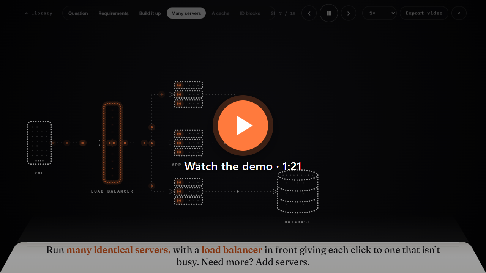
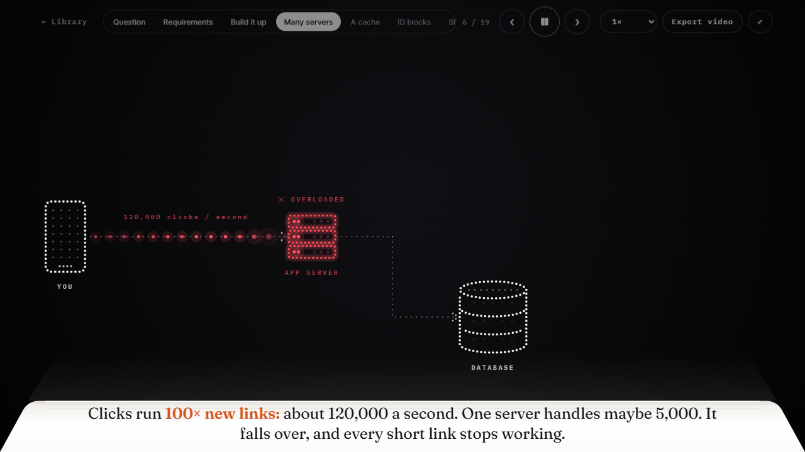
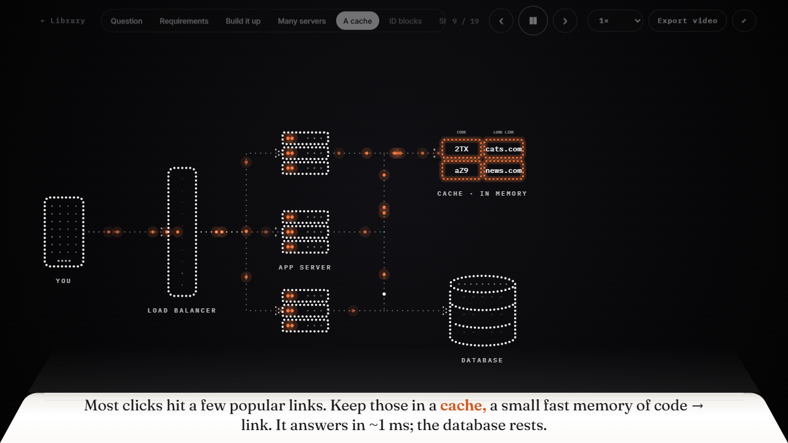
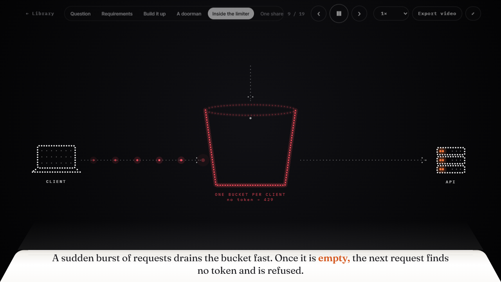
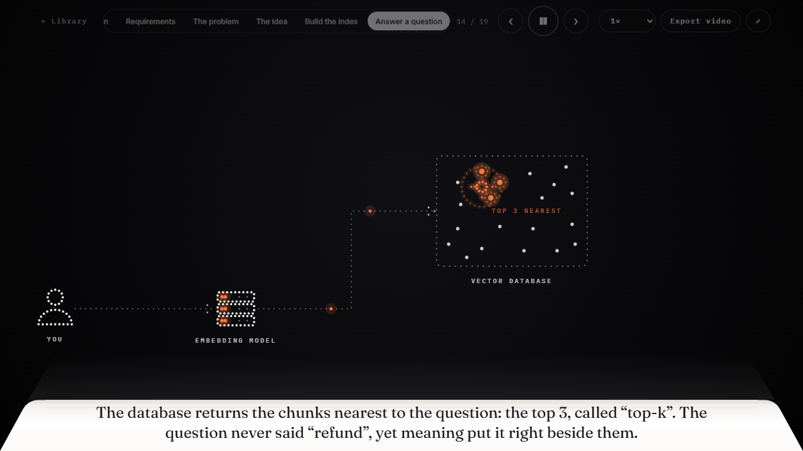
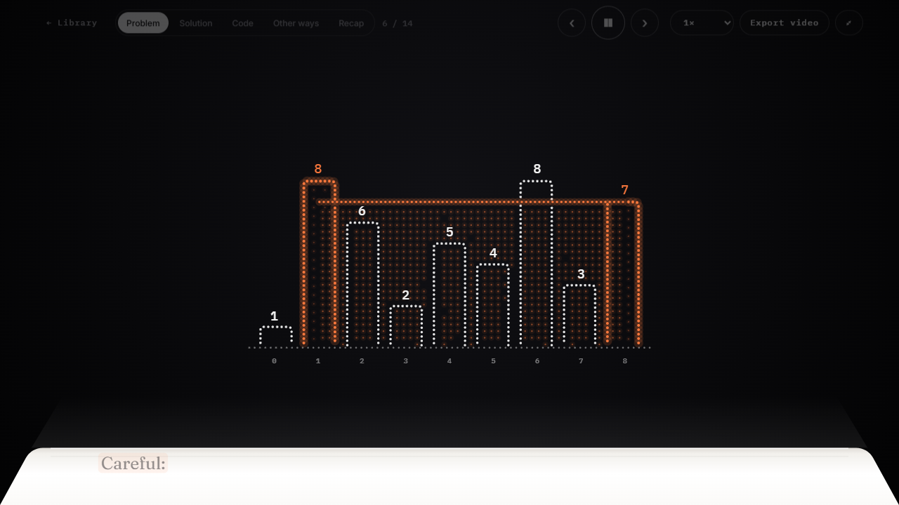
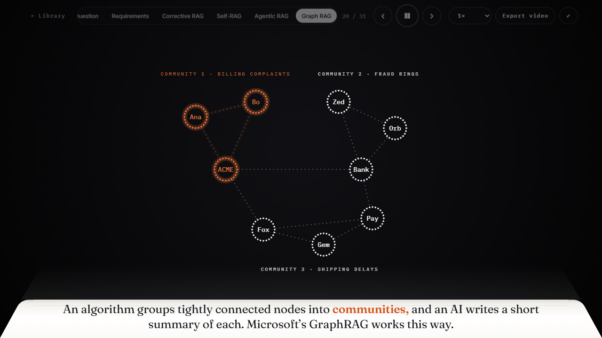
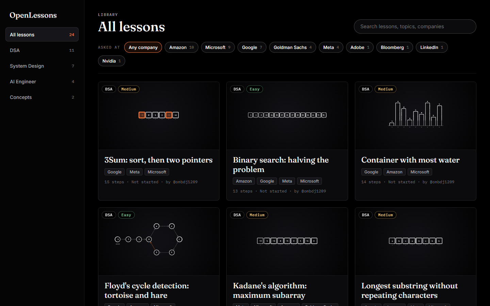

<div align="center">

# OpenLessons

**Open source, animated lessons for DSA, system design and AI engineering.**
Watch the idea move, see exactly where it breaks, then test yourself.

[](https://github.com/ombdj1209/openlessons/actions/workflows/ci.yml)
[](https://github.com/ombdj1209/openlessons/actions/workflows/deploy.yml)
[](LICENSE)
[](CONTRIBUTING.md)

[**Open the live demo**](https://ombdj1209.github.io/openlessons/) &nbsp;·&nbsp; [Lessons](#lessons) &nbsp;·&nbsp; [Write a lesson](CONTRIBUTING.md) &nbsp;·&nbsp; [Lesson format](docs/LESSON_FORMAT.md)

<br>

<a href="https://github.com/ombdj1209/openlessons/blob/main/docs/media/demo.mp4"></a>
<br><sub>Click to play the demo (1 minute 21 seconds, no sound)</sub>

</div>

## Why OpenLessons

Most interview prep is a wall of text and a static diagram. You read that a cache "reduces load", but you never *see* the database drown, the requests die, and the cache take the pressure off.

OpenLessons draws every lesson with a few thousand moving dots. A system starts tiny, real traffic flows through it, the part that breaks turns red and drops requests, and only the fix moves into place while everything else holds still. Algorithms walk through real inputs one step at a time. Every lesson pauses for quick questions, so you find out what actually stuck.

Every lesson is a single JSON file. If you can explain something, you can add it.

## Demo

| | |
|:---:|:---:|
| <br>**Where it breaks.** The overloaded part turns red and refused requests die on the spot. | <br>**Then the fix.** A cache appears and takes the traffic. Nothing else moves. |
| <br>**Mechanisms you can see.** A token bucket drains under a burst and refuses the rest. | <br>**AI concepts made visual.** A question lands on the embedding map beside its nearest chunks. |
| <br>**Algorithms on real inputs.** Container With Most Water, worked through bar by bar. | <br>**Graph RAG.** Entities, relationships and communities, drawn as a real graph. |

<p align="center"></p>

## Lessons

24 lessons today, across four shelves. Each one opens straight from these links.

**DSA** (11): the most asked LeetCode problems, each with the problem card, a plain English restatement, a step by step walk on a real input, quick checks, the code, and *what to use instead if the rules change*.

| Lesson | Level | Asked at |
|---|---|---|
| [Two Sum, explained in depth](https://ombdj1209.github.io/openlessons/#/lesson/two-sum-explained-in-depth) | Easy | Amazon, Google, Adobe |
| [Binary search: halving the problem](https://ombdj1209.github.io/openlessons/#/lesson/binary-search-halving-the-problem) | Easy | Amazon, Google, Meta |
| [Floyd's cycle detection: tortoise and hare](https://ombdj1209.github.io/openlessons/#/lesson/floyd-cycle-detection-tortoise-and-hare) | Easy | Google, Amazon, Microsoft |
| [Kadane's algorithm: maximum subarray](https://ombdj1209.github.io/openlessons/#/lesson/kadane-maximum-subarray) | Medium | Meta, Microsoft, Amazon |
| [Longest substring without repeating characters](https://ombdj1209.github.io/openlessons/#/lesson/longest-substring-without-repeating-chars) | Medium | Google, Amazon, Meta |
| [3Sum: sort, then two pointers](https://ombdj1209.github.io/openlessons/#/lesson/three-sum-sort-and-two-pointers) | Medium | Google, Meta, Microsoft |
| [Container with most water](https://ombdj1209.github.io/openlessons/#/lesson/container-with-most-water) | Medium | Google, Amazon, Microsoft |
| [Merge intervals: sort, then sweep](https://ombdj1209.github.io/openlessons/#/lesson/merge-intervals-sort-then-sweep) | Medium | Amazon, Microsoft |
| [LRU cache: hash map plus linked list](https://ombdj1209.github.io/openlessons/#/lesson/lru-cache-hash-map-plus-linked-list) | Medium | Amazon |
| [Top K frequent elements: bucket sort](https://ombdj1209.github.io/openlessons/#/lesson/top-k-frequent-elements) | Medium | Amazon, Microsoft |
| [Trapping Rain Water with two pointers](https://ombdj1209.github.io/openlessons/#/lesson/trapping-rain-water-two-pointers) | Hard | Microsoft, Amazon, Google |

**System Design** (7): each design grows from one server. You watch it break under load, and each fix arrives exactly where the failure was.

| Lesson | Level | What breaks, and what fixes it |
|---|---|---|
| [Design a URL shortener](https://ombdj1209.github.io/openlessons/#/lesson/design-url-shortener) | Easy | overload, database hot spot, duplicate codes, full disk |
| [Design a rate limiter](https://ombdj1209.github.io/openlessons/#/lesson/design-rate-limiter) | Medium | noisy clients, token buckets, split limits, race conditions |
| [Design a chat app like WhatsApp](https://ombdj1209.github.io/openlessons/#/lesson/design-chat-app-like-whatsapp) | Medium | polling, routing, ticks, offline delivery, duplicate sends |
| [Design Twitter's home timeline](https://ombdj1209.github.io/openlessons/#/lesson/design-news-feed-like-twitter) | Medium | slow reads, fan out on write, the celebrity problem |
| [Design a ride hailing app like Uber](https://ombdj1209.github.io/openlessons/#/lesson/design-ride-hailing-like-uber) | Hard | location floods, geo cells, double booking |
| [How data moves](https://ombdj1209.github.io/openlessons/#/lesson/how-data-moves) | Easy | client, server, database, indexes, replicas |
| [Production system design, part by part](https://ombdj1209.github.io/openlessons/#/lesson/production-system-design-part-by-part) | Medium | CDN, load balancing, caching, queues, auth |

**AI Engineer** (4): retrieval augmented generation from first principles to the newest variants.

| Lesson | Level | Covers |
|---|---|---|
| [How RAG works, step by step](https://ombdj1209.github.io/openlessons/#/lesson/how-rag-works-step-by-step) | Medium | chunks, embeddings, vector search, prompts, citations |
| [When RAG breaks, and how to fix it](https://ombdj1209.github.io/openlessons/#/lesson/when-rag-breaks-and-how-to-fix-it) | Medium | contextual retrieval, hybrid search, reranking, freshness, permissions, evaluation |
| [Types of RAG: naive, advanced, modular](https://ombdj1209.github.io/openlessons/#/lesson/rag-types-naive-advanced-modular) | Medium | query rewriting, HyDE, multi query, routers |
| [Types of RAG: corrective, agentic, graph and more](https://ombdj1209.github.io/openlessons/#/lesson/rag-types-graph-corrective-agentic) | Hard | CRAG, Self RAG, agentic, Graph RAG, multimodal, adaptive |

**Concepts** (2): [How DNS finds a website](https://ombdj1209.github.io/openlessons/#/lesson/how-dns-finds-a-website) · [How OAuth token refresh works](https://ombdj1209.github.io/openlessons/#/lesson/how-oauth-token-refresh-works)

> Company names come from public, community maintained question lists. They mean "reported as asked", not an endorsement.

## Features

* **Motion that explains.** Parts that don't change between steps keep every dot in place, so your eye goes straight to what changed.
* **Failure you can see.** Broken parts turn red, refused requests fade out where they die, and the fix appears in their place.
* **Interview shaped.** Problem card, plain English restatement, walkthrough, code, trade offs, recap.
* **Retrieval practice.** Quick checks pause the lesson until you answer, then explain why.
* **Explore while you watch.** Hover or click any part for a short note. Jump between chapters. Change speed.
* **Picks up where you left off.** Progress is saved in your browser, with "continue" chips in the library.
* **Export to MP4.** Any lesson renders to video in your browser, frame accurate, ready for slides or a class.
* **Private by design.** No backend, no account, no tracking. It is a static site that works from any host.
* **Lessons as data.** Each lesson is one JSON file, checked against a strict schema with editor autocomplete.

## Quick start

You need Node.js 20 or newer.

```bash
git clone https://github.com/ombdj1209/openlessons.git
cd openlessons
npm install
npm run dev
```

Open the printed address (usually http://localhost:5173). Edit any `lesson.json` and the page updates instantly.

### Player controls

| Key | Action |
|---|---|
| <kbd>Space</kbd> | Play or pause |
| <kbd>←</kbd> <kbd>→</kbd> | Previous or next step |
| <kbd>Home</kbd> <kbd>End</kbd> | First or last step |
| <kbd>R</kbd> | Restart |
| <kbd>F</kbd> or double click | Full screen |
| <kbd>1</kbd> to <kbd>4</kbd> | Answer a quick check |
| <kbd>Esc</kbd> | Close a pinned note |

Click anywhere on the stage to advance. Click a part with a note to pin it.

## Write a lesson

A lesson is a folder with one file: `lessons/<Category>/<slug>/lesson.json`. Here is a complete, working one:

```json
{
  "$schema": "../../../lesson.schema.json",
  "title": "Hello, dots",
  "question": "What does a tiny lesson look like?",
  "createdAt": "2026-10-09",
  "authors": ["your-github-username"],
  "steps": [
    {
      "caption": "A *server* answers requests.",
      "form": { "type": "shapes", "items": [{ "shape": "server", "at": [800, 400], "label": "SERVER" }] }
    },
    {
      "caption": "Too many requests and it *falls over*.",
      "form": {
        "type": "shapes",
        "items": [{ "shape": "server", "at": [800, 400], "label": "SERVER", "fail": true }],
        "flows": [{ "path": [[200, 400], [680, 400]], "fail": true, "drop": true, "count": 10 }]
      }
    }
  ]
}
```

Save it, and it shows up in the library. Then run the checks:

```bash
npm run check-lessons hello-dots
```

The full guide, including the teaching patterns that make lessons land, is in **[CONTRIBUTING.md](CONTRIBUTING.md)**. Every field and all 23 shapes are documented in **[docs/LESSON_FORMAT.md](docs/LESSON_FORMAT.md)**.

## How it works

Each step describes a *formation*: shapes such as servers, arrays, buckets or an embedding map, plus flows of moving dots. The engine samples every shape into points, then sends each dot to the nearest free target, so one formation melts into the next. Lessons that set a fixed `spacing` sample unchanged parts identically in every step, and those dots never move. That is how a growing system diagram changes only where it matters.

Everything renders to one `<canvas>` with a fixed time step, which is why the MP4 export matches the player frame for frame. More detail is in [docs/ARCHITECTURE.md](docs/ARCHITECTURE.md).

**Built with** React 19, TypeScript, Vite, the Canvas 2D API, [zod](https://zod.dev) for the lesson schema, [idb](https://github.com/jakearchibald/idb) for progress, and [Mediabunny](https://mediabunny.dev) with WebCodecs for video export.

### Project layout

```
lessons/<Category>/<slug>/lesson.json   the lessons (content lives here)
src/dots/engine.ts                      the particle engine: formations, flows, captions, checks
src/dots/shapes.ts                      every shape, drawn as points
src/dots/schema.ts                      the lesson schema (source of truth)
src/dots/DotPlayer.tsx                  the full screen player
src/Library.tsx                         the library page
scripts/check-lessons.ts                validates lessons from the command line
lesson.schema.json                      generated JSON Schema for editor autocomplete
tests/                                  every lesson validates, schema rules, shape stability
```

### Scripts

| Command | What it does |
|---|---|
| `npm run dev` | Start the dev server with instant reload |
| `npm run check-lessons [slug]` | Validate all lessons, or one |
| `npm test` | Run the test suite |
| `npm run typecheck` | Type check everything |
| `npm run build` | Production build into `dist/` |
| `npm run verify` | Everything CI runs, in one command |
| `npm run schema` | Regenerate `lesson.schema.json` after changing the schema |

## Deploy your own

The build is a static site with relative paths, so `dist/` works on any static host.

**GitHub Pages** (already set up): push to `main`, and the [deploy workflow](.github/workflows/deploy.yml) validates the lessons, builds, and publishes. In your fork, open **Settings → Pages** and set **Source** to **GitHub Actions** once.

**Anywhere else**: run `npm run build` and upload `dist/` to Netlify, Vercel, Cloudflare Pages, S3 or any web server. No server side code is needed.

## Roadmap

* More lessons: consistent hashing, Kafka style logs, transformers and attention, dynamic programming
* Narration with captions read aloud
* Light theme and a high contrast mode
* Share a link to a single step
* A visual lesson editor

Ideas and votes live in [Discussions](https://github.com/ombdj1209/openlessons/discussions). Lesson requests go in [issues](https://github.com/ombdj1209/openlessons/issues/new?template=lesson_request.yml).

## Contributing

New lessons, fixes to existing ones, and engine improvements are all welcome. Start with [CONTRIBUTING.md](CONTRIBUTING.md); it walks you from an empty folder to a merged lesson. Please follow the [Code of Conduct](CODE_OF_CONDUCT.md). Security issues go through [SECURITY.md](SECURITY.md), not public issues.

Every lesson credits its writers in its `authors` field, and the library shows them on each card.

## Contributors

### Maintainer

<table>
  <tr>
    <td align="center">
      <a href="https://github.com/ombdj1209"><br><b>@ombdj1209</b></a><br>
      Creator and maintainer<br>
      <a href="mailto:omprakashbdj1209@gmail.com">omprakashbdj1209@gmail.com</a>
    </td>
  </tr>
</table>

### Everyone who contributed

<a href="https://github.com/ombdj1209/openlessons/graphs/contributors">
  
</a>

Your face goes here after your first merged pull request.

## License

OpenLessons is licensed under the [Apache License 2.0](LICENSE). The lessons are part of the project and use the same license. See [NOTICE](NOTICE).

Copyright 2026 The OpenLessons Authors.
